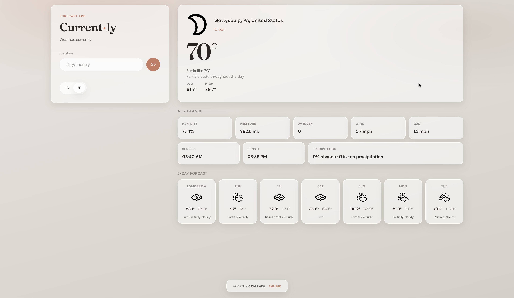

# Current<span style="color: #c97b63;">·</span>ly

A browser weather app for looking up **current conditions** and a **7-day outlook** for any city or country. Search from a minimal landing screen, then explore a glass-style dashboard with live temperature, “feels like,” daily highs and lows, humidity, wind, sunrise/sunset, precipitation, and a week of forecast cards – all driven by the [Visual Crossing Timeline Weather API](https://www.visualcrossing.com/weather-api/).

There is no backend. The app runs entirely in the browser: **Webpack** bundles vanilla JavaScript modules, and each search fetches fresh JSON from Visual Crossing. The UI uses plain **HTML** and **CSS** (warm neutrals, terracotta accent, **Fraunces** display type, **DM Sans** UI type) with two views — an **idle** search screen and a **ready** layout with sidebar — toggled by adding or removing a `hide` utility class. A full-screen **loading** overlay appears while a request is in flight; inline errors show under the active search form when a location fails or the network drops.

This was built as a learning / portfolio piece (thanks to **The Odin Project** community), with my own **Current<span style="color: #c97b63;">·</span>ly** branding and styling. If you are reading the repo, you will see how **data models**, **API orchestration**, and **DOM rendering** are kept in separate modules, how async fetch/render flows use `try/catch/finally`, and how icon assets are loaded on demand to match API `icon` ids.

### What’s on `main` (current code)

The **default branch** uses **ES6 classes** for `Weather` and `MiniWeather`, plus **IIFE-style modules**:

- **`AppController`** — fetches from Visual Crossing, maps API JSON into `Weather` / `MiniWeather` instances, stores `currentWeather` and `weeklyForcast`, tracks °F/°C preference, and exposes conversion helpers
- **`UiController`** — wires idle and ready search forms, validates empty input, shows/hides loading, renders the hero, metrics, and weekly grid, toggles idle/ready views, and handles unit buttons (re-render without refetch)
- **`Weather`** — full snapshot for “right now” (location, temps, atmosphere, wind, sun, precipitation, condition, icon, description)
- **`MiniWeather`** — lightweight shape for one forecast day (day of the week, min/max, icon, condition)

The UI is bundled with **Webpack 5** (dev server, production build, GitHub Pages deploy). Runtime code is still vanilla JavaScript — no React, Vue, or similar.

<p align="center">
  
</p>

#### Key engineering concepts used in this project

- **`Weather` and `MiniWeather` as ES6 classes** — `Weather` normalizes API fields (e.g. sunrise/sunset via **`date-fns`**); `MiniWeather` holds only what the weekly cards need
- **IIFE modules** — `AppController` and `UiController` export a small public API without polluting the global scope
- **Separation of concerns** — API + state vs DOM + events; the UI never calls `fetch` directly
- **Idle / ready views** — two search UIs share one `fetchWeather` pipeline; success switches from `#app-idle` to `#app-ready`
- **`async` / `await` with `try/catch/finally`** — loading overlay shown at fetch start, hidden in `finally`; API errors surfaced in context-appropriate error elements
- **HTML5 constraint validation** — `setCustomValidity` + `reportValidity` for empty location on submit
- **Client-side °F → °C toggle** — API data stored in US units; conversion at render time via `AppController.convertToCelcius` (no refetch on unit change)
- **Dynamic SVG imports** — webpack resolves `../assets/weather-icons/${icon}.svg` for hero and weekly icons (Visual Crossing icon ids)
- **Sequential weekly render** — `for...of` + `await` keeps forecast cards in order; grid cleared before each render
- **Loading overlay** — `#loading` with `loading--hidden`; fixed spinner panel over a dimmed backdrop
- **Glass layout** — sidebar + hero + metric cards + 7-column weekly grid; responsive grid for metrics and forecast

## Getting Started

### **Try it online**

**Live app:** [https://soikat27.github.io/currently/](https://soikat27.github.io/currently/) — opens in the browser; requires network access for weather data.

> **Note:** The live demo uses a Visual Crossing API key bundled in the client. For your own fork, replace it with your key (see **API key** below).

### **Run it locally** (if you are cloning or tweaking the code)

You need **Node.js** and **npm** for the Webpack dev server and production build.

#### **Prerequisites**

- **Node.js** (LTS recommended) and **npm**
- **Git** (only if you use `git clone` below; otherwise use GitHub **Code → Download ZIP**)
- A free [Visual Crossing Weather API](https://www.visualcrossing.com/weather-api/) key

#### Check that Git is installed (only if you clone)

```bash
git --version
```

#### **Installing**

##### 1. Clone this repository and open the project directory

```bash
git clone https://github.com/soikat27/currently.git
```

```bash
cd currently
```

##### 2. Install dependencies

```bash
npm install
```

##### 3. API key

Sign up at [Visual Crossing](https://www.visualcrossing.com/weather-api/), create an API key, and set it in `src/modules/app-controller.js` (replace the placeholder `API_KEY` constant). Do not commit a personal key if you plan to open-source a fork — use environment injection or a private config for production.

#### **Running locally**

Start the development server (opens in the browser with hot reload):

```bash
npm run dev
```

#### **Production build**

```bash
npm run build
```

Built files are written to `dist/`. You can serve that folder with any static host or use `npm run deploy` for GitHub Pages.

## Using the app

The same behavior applies on the [live demo](https://soikat27.github.io/currently/) and when you run the dev server locally.

### Features

- **Location search** — city or country from the idle landing page or the ready sidebar
- **Current conditions** — large temp, condition, feels like, today’s low/high, description, and weather icon
- **At a glance** — humidity, pressure, UV index, wind, gust, sunrise, sunset, precipitation (chance, amount, type)
- **7-day forecast** — seven cards starting with **Tomorrow**, then weekday labels; high/low, icon, and short condition per day
- **°F / °C toggle** — switches display units on the current dashboard and weekly highs/lows without a new API call
- **Loading state** — full-screen “Fetching weather…” overlay during search
- **Validation** — empty search shows the browser’s native validation message
- **Errors** — bad location vs generic network message under the form that submitted the search; last good weather stays visible on the ready page when a later search fails

### Usage

- Open the app → **idle** view with centered brand and search
- Enter a location → **Go** → loading overlay → **ready** view with weather
- Use the **sidebar search** to change location without returning to idle
- Toggle **°C** / **°F** in the sidebar to convert displayed temperatures
- On failure, read the red message under the search field and try again

### Upcoming features

- Move API key to an environment variable (keep secrets out of the bundle)
- Geolocation or remembered last city on load
- Metric wind / precipitation units when °C is selected
- Fallback icon when the API returns an id missing from the local icon set

## Available Scripts

- `npm run dev` — Webpack Dev Server with hot reload
- `npm run build` — production build into `dist/`
- `npm run deploy` — `npm run build` then publish `dist/` to the `gh-pages` branch via `gh-pages`
- `npm run lint` / `npm run lint:fix` — ESLint
- `npm run format` / `npm run format:check` — Prettier

## Deployment

The deploy script runs:

```bash
npm run build && gh-pages -d dist
```

That builds the project, then publishes the generated `dist/` folder to GitHub Pages. This repo is set up for **https://soikat27.github.io/currently/** — update `homepage` in `package.json` if you fork or rename the repository.

You could also host the same `dist/` output on Netlify, Cloudflare Pages, or any static file host.

## Built with

- Plain **HTML**, **CSS**, and **JavaScript** (no UI framework)
- **[Visual Crossing Timeline Weather API](https://www.visualcrossing.com/weather-api/)** — current conditions + daily timeline
- **Webpack 5** — `webpack.common.js`, `webpack.dev.js`, `webpack.prod.js`
- **HtmlWebpackPlugin** + **html-loader** — builds from `src/template.html`
- **`date-fns`** — sunrise/sunset formatting and forecast day labels
- **ES6 classes** — `Weather`, `MiniWeather`
- **IIFE modules** — `AppController`, `UiController`
- **Dynamic `import()`** — on-demand SVG weather icons
- **Google Fonts (bundled)** — Fraunces, DM Sans

## Weather icons

Monochrome SVG icons are from **[Visual Crossing WeatherIcons](https://github.com/visualcrossing/WeatherIcons)** ([LGPL-3.0](https://www.gnu.org/licenses/lgpl-3.0.txt)). They align with the `icon` field returned by the Visual Crossing API. Icons live in `src/assets/weather-icons/`.

## Contributing

Contributions are welcome. Open an issue or send a PR if you want to improve error handling, accessibility, unit conversion, icon fallbacks, or teach me something I missed.

## Author

- **Soikat Saha** — design and implementation

## License

This project is licensed under the MIT License — see the [LICENSE](LICENSE) file for details.

Weather icon assets are subject to the **LGPL-3.0** license from [visualcrossing/WeatherIcons](https://github.com/visualcrossing/WeatherIcons).

## Acknowledgments

- Shoutout to the **Odin Project** community and curriculum for overall guidance and the push toward modular JavaScript.
- **[Visual Crossing](https://www.visualcrossing.com/)** for the Timeline Weather API and the matching [WeatherIcons](https://github.com/visualcrossing/WeatherIcons) set.
- Thanks to everyone who maintains solid **MDN** docs — `fetch`, forms, and constraint validation got plenty of use.
- Built on my own **Webpack starter template**; kept the runtime vanilla on purpose so the module boundaries stay easy to follow in a portfolio read-through.
